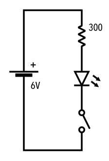

# 課題1　タクトスイッチ
タクトスイッチを押すことでLEDが点灯するシンプルな回路。

## 回路図

## 使用パーツ
- [電源](../components/01--battery.md)
- [LED](../components/02--led.md)
- [抵抗 300Ω](../components/03--resistor.md)
- [スイッチ](../components/04--tactswitch.md)

## 課題提出リスト
- Tinkercad回路URL
- ブレッドボード回路の写真
- ブレッドボード回路の動作動画

## 解説

まずは、最低限のパーツだけで出来るシンプルな回路に取り組んでみる。 
抵抗をつけずに直接電源にLEDを繋ぐと、**LEDが焼き切れて壊れてしまう**ので注意。