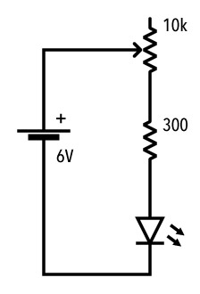

# 課題2　可変抵抗
抵抗を変化させることが出来る**可変抵抗**を使ってLEDの明るさをコントロール出来る回路を組む。
また、ブレッドボードで動作が確認出来たらユニバーサル基板への実装を行う。

### 回路図

### 使用パーツ
- [電源](../components/01--battery.md)
- [LED](../components/02--led.md)
- [抵抗 300Ω](../components/03--resistor.md)
- [可変抵抗 10kΩ](../components/05--potentiometer.md)

### 課題提出リスト
- Tinkercad回路URL
- ブレッドボード回路の写真
- ブレッドボード回路の動作動画

### 解説
回路が組めたら、可変抵抗を10kΩだけでなく、500kΩのものでも試してみよう。

ユニバーサル基板への実装の際、再利用したいパーツ(電源、可変抵抗)は、 
**ターミナルブロック**を使用して着脱可能にしておく。
