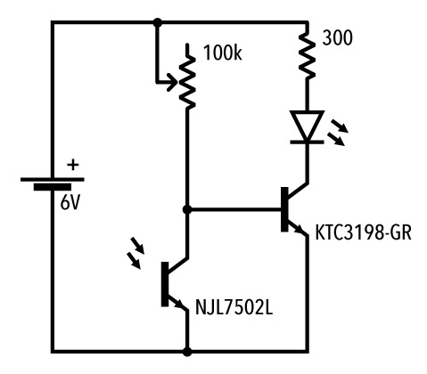

# 課題3　フォトトランジスタ
フォトトランジスタ(明るさセンサ)を使用して、暗所に置かれるとLEDが点灯する回路を組む。 
今までのシンプルな一本道ではなく、途中分岐・合流が存在する回路の作り方を習得しよう。

### 回路図

### 使用パーツ
- [電源](../components/01--battery.md)
- [LED](../components/02--led.md)
- [抵抗 300Ω](../components/03--resistor.md)
- [可変抵抗 10kΩ](../components/05--potentiometer.md)
- [トランジスタ](../components/07--transistor.md)
- [フォトトランジスタ](../components/08--phototransistor.md)

### 課題提出リスト
- Tinkercad回路URL
- ブレッドボード回路の写真
- ブレッドボード回路の動作動画

### 解説

