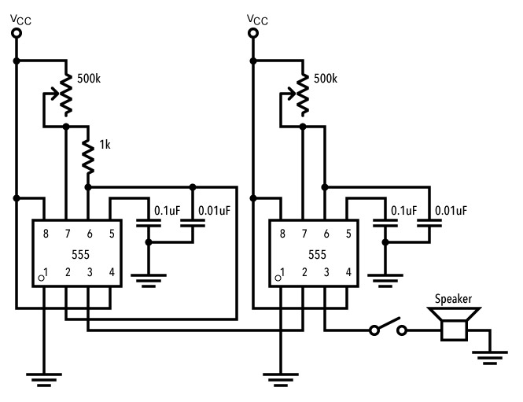

# 課題5　APC (Atari Punk Console)
レトロゲームっぽい音を作り出せる電子回路 **アタリ・パンク・コンソール（APC）** を作る。 
一見複雑そうに見えるものの、実は課題４の回路が２つ連結されているような形になっている。

## 回路図

## 使用パーツ
- [電源](../components/01--battery.md)
- [抵抗 1kΩ](../components/03--resistor.md)
- [スイッチ](../components/04--tactswitch.md)
- [可変抵抗 500kΩ](../components/05--potentiometer.md)
- [可変抵抗 500kΩ](../components/05--potentiometer.md)
- [コンデンサ 0.1uF](../components/09--capacitor.md)
- [コンデンサ 0.01uF](../components/09--capacitor.md)
- [555](../components/10--555.md)
- [スピーカー](../components/11--speaker.md)

## 課題提出リスト
- Tinkercad回路URL
- ブレッドボード回路の写真
- ブレッドボード回路の動作動画
- ユニバーサル基板回路の写真
- ユニバーサル基板回路の動作動画

## 解説

### 電源回路記の省略
[電源のページ](../components/01--battery.md)で解説されているように、回路が大きくなってきたため、電源の回路記号は省略し、VccとGND記号で電源に繋がるべき線を指示している。 
全てのVccは6V電源の＋側に、全てのGNDは6V電源の－側に接続すること！