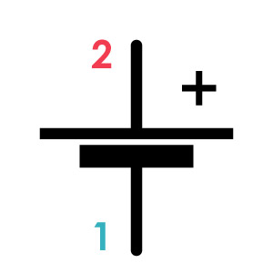
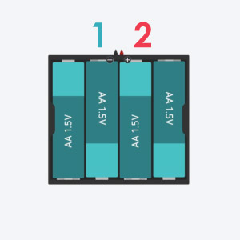
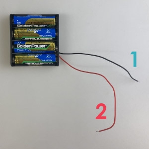
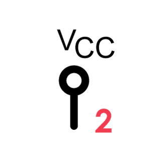
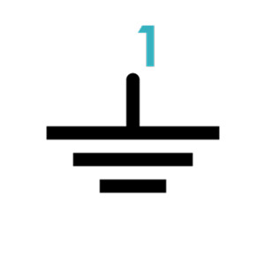

# 電源
回路の心臓部であり、ここが無いともちろん電気が流れない。 
どんなに回路が枝分かれしようとも、基本的に電源＋側から出た電気が、電源－側に戻ってくるように作られているはず！

**＋と－のつなぎ間違いは一発で繊細なパーツをダメにするので注意！**

||||
|:--|:--|:--|
|回路記号|Tinkercad|パーツ|

### 各足の対応 (極性あり!)
**1** 
電源の－(マイナス)。電子回路上では **GND (グラウンド)** と呼ばれる。

**2** 
電源の＋(プラス)。電子回路上では **Vcc (ブイシーシー)** と呼ばれる。 
他に、Vin(ブイイン)、+V(プラスブイ)と表記されることもある。 
近くに電源の電圧が表記されている時もある（今回の場合だと6V）。

### 機能概要
乾電池、LiPoバッテリー、DCアダプターなど直流の電気を提供してくれる装置はすべて直流電源と呼ぶ。 
今回の場合は、1.5Vの単三電池が４本直列に繋がれた6V電源を使用する。 
やりたいことによって、電源の電圧は変える必要がある。

### 補足説明

#### 電源記号の省略
電源のVcc(＋)とGND(－)は回路のいたるところに接続する為、回路が大きく複雑になっていくと電源からの線が集中して、回路が見にくくなってしまう事がよくある。 
そこで、あえて電源の記号そのものは描かず、下図のようなVccとGNDの記号を分散して回路図中に描くことで、回路を見やすくする **お作法** がある。 

[課題4の回路](../assignments/04--single555.md)と[課題5の回路](../assignments/05--APC.md)では、このルールが使われているのでチェックしてもらいたい。

|||
|:--|:--|
|Vcc回路記号|GND回路記号|