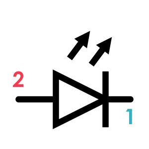
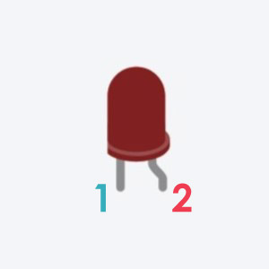
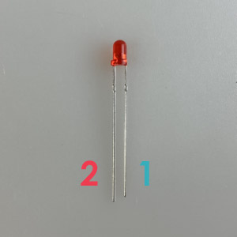

# LED
光(Light)・放つ(Emitting)・ダイオード(Diode)！略して **LED** 。 
その名の通り電気が流れると光る電子パーツで、いろんな色が存在する。(今回は赤色を使用) 
２本の足は、プラス側につながる方(電気が流れ込んでくる方)とマイナス側につながる方(電気が出ていく方)が決まっており、正しい向きに繋がないとうまく動かない。下手すると壊れてしまう。 
こういう風に、電気の流れる方向に対して接続する向きが決まってる部品の事を **極性がある** と表現する。 
逆に、電気の方向に対して接続を反対にしてもOK、どちらでもうまく動く部品の事を**極性がない** と表現する。

||||
|:--|:--|:--|
|回路記号|Tinkercad|パーツ|

## 各足の対応 (極性あり!)
**1** 
**カソード** : GND側(電源のマイナス側)を接続する足。

**2** 
**アノード** : Vcc側(電源のプラス側)を接続する足。 
※カソードよりもアノードの方がちょっぴり足が長いのが見分けるコツ。

## 機能概要
光るし安いって事で、電子工作では人気のあるパーツだけど、繊細なので取り扱いには注意が必要。 
足を逆に繋いだり、過剰な電流を流してしまうと、熱くなって内部の線が焼き切れてしまい、光が灯らなくなる。

## 補足説明

### 保護抵抗

そんな繊細なLEDを過剰な電流から守るために、LEDの横には抵抗を繋げて電流の量を抑える設計を行っている回路がよくある。詳しくは、“LED　保護抵抗　計算”などのキーワードで検索してみると良し。 
参考サイトをちょっとあげとく↓
- [LEDを壊さない抵抗値の求め方](https://zenn.dev/megeton/articles/167476686050ad)
- [LEDの抵抗値計算](https://akizukidenshi.com/catalog/pages/led-r-calc.aspx)