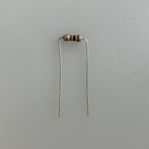
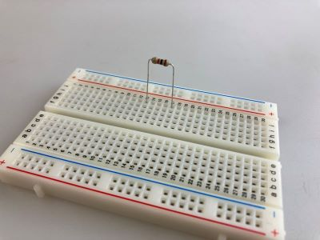
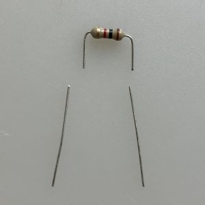
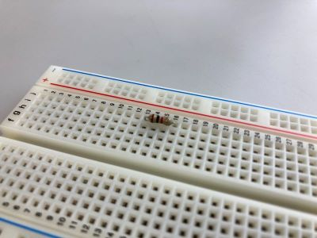

# 抵抗
電気の流れを抑えて、他のパーツにとってちょうど良い電流・電圧量に変えるための電子パーツ。 
これ単体で何か動作するってことはないけど、縁の下の力持ち的な存在で、ほぼ全ての電子回路に使われているであろう部品。 

||||
|:--|:--|:--|
|回路記号|Tinkercad|パーツ|

## 各足の解説（極性なし）
**1** 
プラスマイナス特に指定なし

**2** 
プラスマイナス特に指定なし

※極性なし、なのでひっくり返して接続しても問題なし

## 補足説明

### カラーコード
抵抗には、カラーコードと呼ばれる４本の線がプリントされており、この線の色の組み合わせで抵抗値を調べることが出来る。

- [抵抗器のカラーコード・表示の読み方、覚え方](https://www.akaneohm.com/column/marking/)
- [resisto.rs](http://resisto.rs/)

### 足の長さ調整
抵抗は、足がまっすぐのままだと使いずらいので、下の写真のように90度にそれぞれ曲げて使う。 

このままでも十分使えるが、ブレッドボードに挿すと結構飛び出た感じになる。 
なによりむき出しの足が他の線に接触すると思わぬところで回路がショートしてしまう。 

そこで、ニッパーで足を短くする、大体1cmくらいの長さにできると良い。 
切りすぎるとブレッドボードに刺さりずらくなるので注意！ 

足の長さを調整した抵抗はおさまりが良く、すっきりした回路になる。 

切り取った抵抗の足は捨てずにとっておこう。ユニバーサル基板へのはんだ付けの際に有用だ。