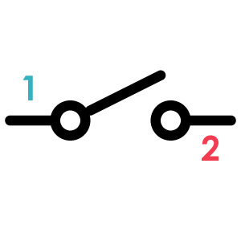
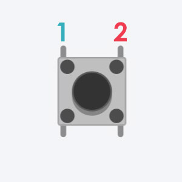
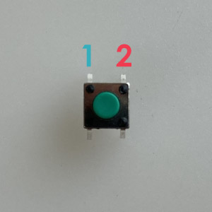
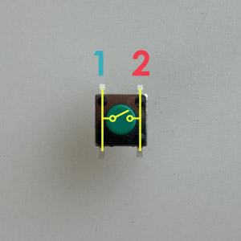

# スイッチ
物理的に回路の一部を繋いだり/離したりする部品。 
今回はタクトスイッチという種類のスイッチを使用する。

||||
|:--|:--|:--|
|回路記号|Tinkercad|パーツ|

## 各足の解説 (極性なし)
**1** 
スイッチが押されているときだけ、内部で2と接続する

**2** 
スイッチが押されているときだけ、内部で1と接続する

タクトスイッチには４本の足がついているが、その内２本ずつが下の画像のように内部で常につながっている。

そして、スイッチが押されているときだけ、1側と2側の足全てが接続される仕組みになっている。
