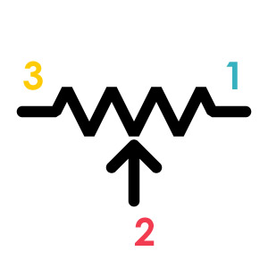
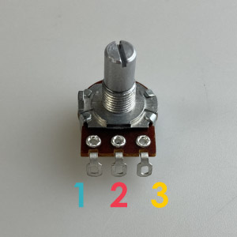
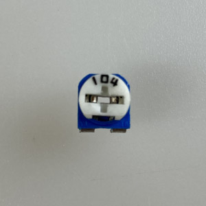
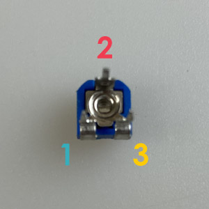
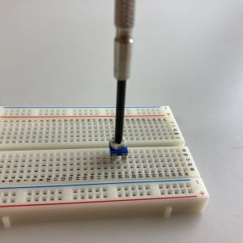

# 可変抵抗
ツマミを回転させることで抵抗値を変化させることが出来る抵抗。

||||
|:--|:--|:--|
|回路記号|Tinkercad|パーツ|

## 各足の解説 (極性なし)
**1** 
ツマミを回すと2との間の抵抗値が変化
今回のワークショップでは、黒い線が接続されている。

**2** 
ツマミを回すと1、3との間の抵抗値が変化
今回のワークショップでは、赤い線が接続されている。

**3** 
ツマミを回すと2との間の抵抗値が変化

## 補足説明

### 別タイプ可変抵抗 (100kΩ)
上記の画像のタイプ以外に、小型の可変抵抗が回路に使用される場合もある。 
小型化のために大きなツマミが排除されているので、精密ドライバーで抵抗値を調整してあげる必要がある。

||||
|:--|:--|:--|
|表側|裏側|ドライバーで抵抗値調整|