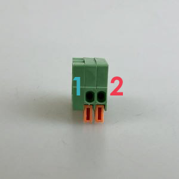

# ターミナルブロック
ユニバーサル基板へはんだ付けでパーツを固定する時に、後で取り外し可能にしたいパーツが度々出てくる。 
そういった際に活躍するのがこの **ターミナルブロック** 。 
交換可能にしたいパーツの代わりにコレをはんだ付けしておけば、ワンタッチで線を接続or交換できるようになる。

||||
|:--|:--|:--|
|回路記号|パーツ（正面）|パーツ（下）|

### 各足の解説（極性なし）
**1** 
極性なしなので、＋－どちらに繋いでもOK。

**2** 
極性なしなので、＋－どちらに繋いでもOK。

今回使用するターミナルブロックには、足が４本ついているがその内２本は**1**の穴と繋がっており、また他の２本は**2**の穴と繋がっている。

### 補足説明

#### 線との接続方法
パーツ上部の穴に、被膜を剥いた線を差し込んで接続するが、そのまま挿しても固定されない。 
 

前面のオレンジのレバーを下に下げながら、線を差し込んでやる必要がある。 
 

線がしっかりと入ったらレバーから手を放す。 
ターミナルブロックが線をロックし、固定されたら装着完了 
 