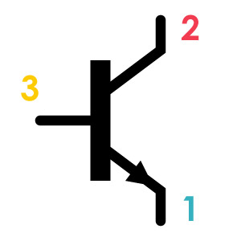
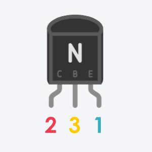
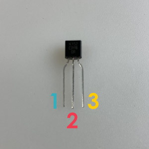
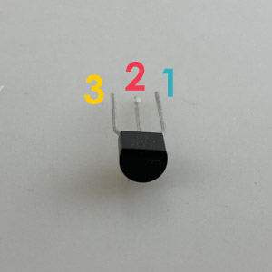

# トランジスタ
普通のスイッチは、ボタンを押されることで２つの足のつなぎ電気を流す。 
それと同じように、電気をトリガーにして回路の線を繋いでくれる機能を持つのがトランジスタ。 

||||
|:--|:--|:--|
|回路記号|Tinkercad|パーツ|

### 各足の解説（極性あり）
**1** 
エミッタ：流れ込んできた電気を出力する足。

**2** 
コレクタ：電気が流れ込んでくる入力側の足。

**3** 
ベース：ここに電気が流れると、はじめてコレクタからエミッタへ電気を流す。 
スイッチのボタンのような役割を持つ足。

※Tinkercadと実際のパーツでは、エミッタ・コレクタ・ベースの順番が違うので注意！

↑パーツを真上から見た時の足の順番。
