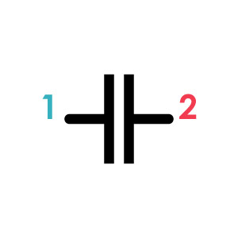
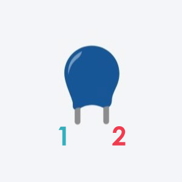
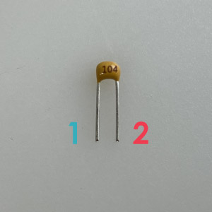

# コンデンサ
短時間だけど、電気をため込む、もしくはためた電気を吐き出すことで、電気の流れを安定させる働きを持つ電子パーツ。色んな種類があるけどこのワークショップではセラミックコンデンサ(極性なし)を使う。

||||
|:--|:--|:--|
|回路記号|Tinkercad|パーツ|

## 各足の解説（極性なし）
**1** 
極性なしなので、＋－どちらに繋いでもOK。

**2** 
極性なしなので、＋－どちらに繋いでもOK。

## 補足説明

### コンデンサの値
コンデンサの電気をため込める量はF(ファラド)という単位で表す。 
セラミックコンデンサの表面には３つの数字が印刷されており、この数字からコンデンサのFは計算できる。

今回使うセラミックコンデンサの場合はこんな感じ↓ 
**0.01uF　：　103** 
**0.1uF　：　104**

参考：[コンデンサの読み方](https://www.matsusada.co.jp/column/resistance-condenser.html#a2)