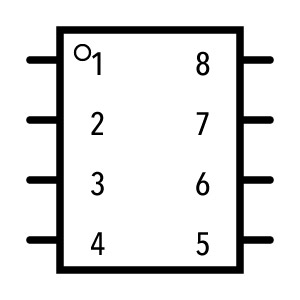
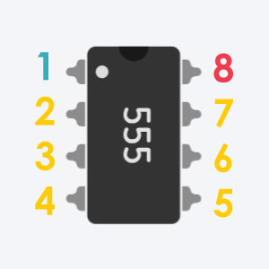
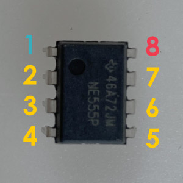

# 555
555タイマーは、各足に接続された線の電圧入力によってパルス波を生み出してくれるICチップ。 
色んな使い方ができる部品だけど、このワークショップではスピーカーを鳴らすための電気の波を生み出す役割を担ってもらう。

||||
|:--|:--|:--|
|回路記号|Tinkercad|パーツ|

## 各足の解説（極性あり！）
表面の〇型の凹みを目印に各足の番号を判断する。

**1** 
GND : 電源供給のための足、GND(電源の－側)と接続される。

**2** 
Trigger : 設定用ピン。

**3** 
Output : 出力用のピン。ここからパルス波が出力される。

**4** 
Reset : 初期化ピン。Vccにつながれることが多い。

**5** 
Control Voltage : 設定用ピン。

**6** 
Threshold : 設定用ピン。

**7** 
Discarge : 設定用ピン。

**8** 
Vcc : 電源供給のための足、Vcc(電源の＋側)と接続される。

**特に1と8番のピンはプラスマイナスを間違えるとチップを壊す可能性があるので注意！**

## 補足説明

555タイマーについてより詳しい情報が欲しい場合は、下記サイトもおススメ↓ 
[555 Timer Tutorial: How It Works and Useful Example Circuits](https://www.build-electronic-circuits.com/555-timer/)