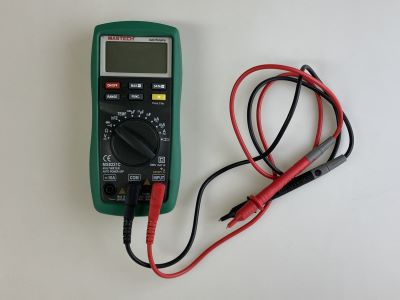
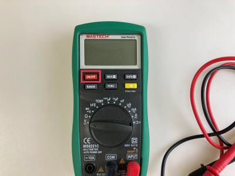
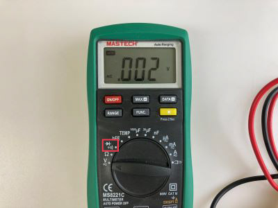
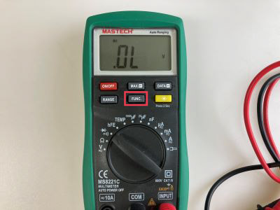
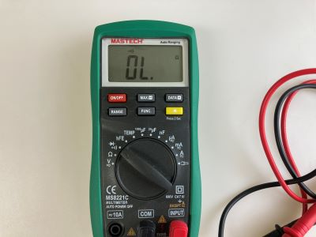
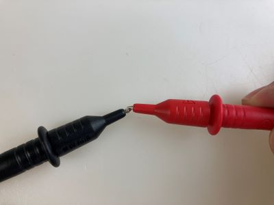

# マルチメーターの使い方

電圧・電流・抵抗値などいろいろな回路の情報を測定できる便利な装置 **マルチメーター**。 
このページではその中の１つ **導通チェック** 機能を紹介する。 
回路製作では、よく使う道具の１つなので覚えておくと便利。

 

**(1)** まずは、**ON/OFF** と書かれている電源ボタンを押して起動させよう。

 

**(2)** 次に、ツマミを回転させて **ダイオードと音のマーク** に△マーク合わせる。 
音マーク → 

 

**(3)** 下の写真のように、液晶画面の上に **ダイオード** の回路記号が表示されたら、 
**FUNC** ボタンを押してモードを切り替える。 
※FUNCボタンを押すたびに、液晶上のダイオードと音マークが交互に切り替わっていくはず。

 

**(4)** 液晶に音マークが表示されたら準備完了。 
本体に接続されているプローブを持とう。

 

**(5)** 試しに赤と黒のプローブの先端同士を触れ合わせると、"ピーッ"と音が鳴る。 
導通モードは赤と黒のプローブの間に電気的な接続が生まれると、音で知らせてくれる。 
つまり、回路上の別の２カ所をそれぞれ触って、もし音が鳴ったらその２点は(パーツを間に)挟まずに直接つながっている、ということ。

 

**(6)** 試しに下のようにジャンパーワイヤをブレッドボードに挿しこんで、その両端をチェックしてみるとちゃんと音が鳴って反応してくれる。

 