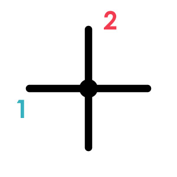
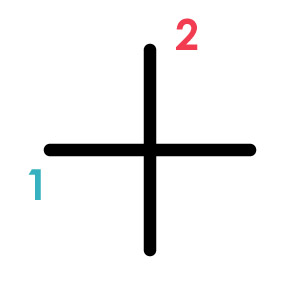
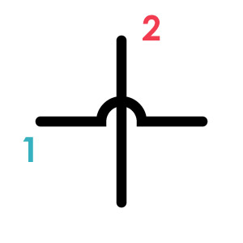

# 回路図の交差点

回路図の中で、線同士が交差している部分には、実は種類がある。 
これを読み間違えると、回路の間違った部分を **繋げてしまう / 離してしまう** 可能性があるので注意。 
複雑な回路ほどこれが出てくるので気を付けること。

## 接続する交差点

下図のように、交差点の部分に黒丸●がある場合、
**1**と**2**の線は接続されているので、**電気的に繋げなければいけない！**

## スルーする交差点

下図のように、交差する部分に何もない場合は、 
**1**と**2**の線は、互いに触れ合うことなく離れて交差しているだけなので、**接続してはならない！**

 

ちなみに、スルーする交差には次のような描き方もある↓

 